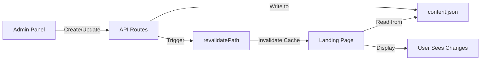

# Admin Panel - Asyifa Koi Farm

Panel admin yang terintegrasi penuh dengan landing page untuk mengelola konten dinamis website.

## 🚀 Quick Start

```bash
# Install dependencies
npm install

# Run development server
npm run dev
```

**Access Admin Panel**: http://localhost:3000/admin

**Default Login**:
- Username: `admin`
- Password: `asyifakoi2024`

## ✨ Features

### 🔐 Authentication
- Secure login page dengan glassmorphism UI
- Protected routes dengan auth guard
- Session management

### 📊 Dashboard
- Real-time statistics
- Quick action buttons
- Beautiful animated cards

### 📝 Content Management
- **Varietas**: Manage koi varieties dengan gambar
- **Galeri**: Upload images/videos dengan status tags
- **Testimoni**: Manage customer testimonials

### 🎨 UI/UX
- Glassmorphism design
- Smooth animations
- Fully responsive
- Dark theme dengan gradient accents

## 🔗 Cara Kerja Integrasi



### Step by Step:

1. **Admin Create/Update Data** di admin panel (http://localhost:3000/admin)
2. **Data Disimpan** ke `app/admin/data/content.json`
3. **Auto Revalidation** - `revalidatePath("/")` dipanggil otomatis
4. **Cache Invalidated** - Next.js menghapus cached landing page
5. **User Refresh** - Landing page di-regenerate dengan data terbaru
6. **Changes Visible** - Perubahan langsung terlihat

## 📝 Testing Integration

### Test Create Varietas

1. Login ke admin panel
2. Klik "Varietas" di sidebar
3. Klik "Tambah Varietas"
4. Isi form dan submit
5. ✅ Buka http://localhost:3000
6. ✅ Varietas baru muncul di section "Varietas Unggulan"

### Test Update & Delete

1. Edit atau delete varietas di admin
2. Refresh landing page (Ctrl+Shift+R)
3. ✅ Perubahan langsung terlihat

### Test Gallery & Testimonials

Sama seperti varietas:
- Create/Update/Delete di admin
- Refresh landing page
- ✅ Changes muncul di section yang sesuai

## 🗂️ File Structure

```
app/
├── admin/
│   ├── components/
│   │   ├── auth-guard.tsx      # Protected route wrapper
│   │   ├── sidebar.tsx         # Navigation sidebar
│   │   └── stat-card.tsx       # Dashboard stat cards
│   ├── dashboard/
│   │   ├── page.tsx            # Main dashboard
│   │   ├── varieties/          # Varietas management
│   │   ├── gallery/            # Gallery management
│   │   └── testimonials/       # Testimonials management
│   ├── data/
│   │   └── content.json        # Data storage (FILE-BASED)
│   ├── lib/
│   │   └── auth.ts             # Auth utilities
│   └── login/
│       └── page.tsx            # Login page
├── api/
│   ├── admin/
│   │   ├── auth/               # Login API
│   │   ├── varieties/          # CRUD varieties
│   │   ├── gallery/            # CRUD gallery
│   │   └── testimonials/       # CRUD testimonials
│   └── content/                # Public content API
└── (landing)/
    └── sections/
        ├── variety-section.tsx      # Reads from content.json
        ├── gallery-section.tsx      # Reads from content.json
        └── testimonials-section.tsx # Reads from content.json
```

## 🔧 Configuration

### Environment Variables

Create `.env.local`:

```env
# Admin Credentials
ADMIN_USERNAME=admin
ADMIN_PASSWORD=asyifakoi2024

# Public Variables
NEXT_PUBLIC_ADMIN_USERNAME=admin
NEXT_PUBLIC_ADMIN_PASSWORD=asyifakoi2024
NEXT_PUBLIC_API_URL=http://localhost:3000
```

### Change Admin Password

Edit `.env.local` dan ganti nilai `ADMIN_PASSWORD`.

## 📊 Data Format

### content.json Structure

```json
{
  "varieties": [
    {
      "id": "1",
      "name": "Kohaku",
      "description": "Kontras merah-putih dengan grade show.",
      "preset": "?variety=Kohaku&grade=Show",
      "media": "https://..."
    }
  ],
  "gallery": [
    {
      "id": "1",
      "title": "Tosai Kohaku 32cm",
      "tag": "Ready",
      "accent": "from-orange-400 via-rose-400 to-sky-400",
      "mediaType": "image",
      "mediaSrc": "https://...",
      "mediaAlt": "..."
    }
  ],
  "testimonials": [
    {
      "id": "1",
      "name": "Hendra S.",
      "title": "Juara Koi Show Surabaya 2024",
      "message": "..."
    }
  ]
}
```

## 🎯 Key Features

### Auto Revalidation
Setiap kali data berubah di admin panel, landing page otomatis di-revalidate:

```typescript
// app/api/admin/varieties/route.ts
async function writeData(data: any) {
  await fs.writeFile(dataPath, JSON.stringify(data, null, 2));
  revalidatePath("/", "page"); // ⚡ Auto revalidation
}
```

### ISR (Incremental Static Regeneration)
Landing page sections menggunakan ISR dengan 60 detik revalidation:

```typescript
// app/(landing)/sections/variety-section.tsx
export const revalidate = 60; // Revalidate every 60 seconds
```

## 🎨 UI Components

### Animations
- Fade-in transitions
- Scale effects on hover
- Smooth modal animations
- Loading spinners

### Responsive Breakpoints
- Mobile: 640px
- Tablet: 768px
- Desktop: 1024px
- Large: 1280px

## 🔒 Security Notes

### Current (Development)
- Simple username/password auth
- LocalStorage session
- File-based data storage

### Recommendations for Production
1. ✅ Implement JWT authentication
2. ✅ Use database (PostgreSQL/MongoDB)
3. ✅ Hash passwords with bcrypt
4. ✅ Enable rate limiting
5. ✅ Force HTTPS
6. ✅ Add CSRF protection
7. ✅ Implement role-based access

## 📚 Documentation

- **Admin Guide**: `/docs/admin-panel-guide.md`
- **Integration Testing**: `/docs/admin-integration-testing.md`
- **Landing Page Overview**: `/docs/landing-page-overview.md`

## 🐛 Troubleshooting

### Changes not showing?
```bash
# Clear Next.js cache
rm -rf .next

# Rebuild
npm run build
npm run dev
```

### Login not working?
- Verify `.env.local` exists
- Check credentials match
- Clear browser localStorage

### Images not loading?
- Verify URL is accessible
- Check `next.config.ts` remote patterns

## 🚀 Deployment

### Vercel (Recommended)

```bash
# Install Vercel CLI
npm i -g vercel

# Deploy
vercel

# Set environment variables in Vercel dashboard
```

### Other Platforms

```bash
# Build
npm run build

# Start
npm start
```

## 📞 Support

Issues? Check:
1. `/docs/admin-integration-testing.md` for testing guide
2. `/docs/admin-panel-guide.md` for detailed documentation
3. Console logs for errors

## ✅ Verification Checklist

Pastikan semua ini bekerja:

- [ ] Login ke admin panel berhasil
- [ ] Create varietas → muncul di landing page
- [ ] Update varietas → update di landing page
- [ ] Delete varietas → hilang dari landing page
- [ ] Create gallery → muncul di landing page
- [ ] Create testimonial → muncul di landing page
- [ ] Responsive di mobile
- [ ] Build production berhasil
- [ ] No console errors

## 🎉 Success!

Jika semua checklist di atas ✅, maka admin panel dan landing page sudah **fully integrated** dan siap digunakan!

---

**Built with**: Next.js 16, React 19, Tailwind CSS 4, TypeScript
